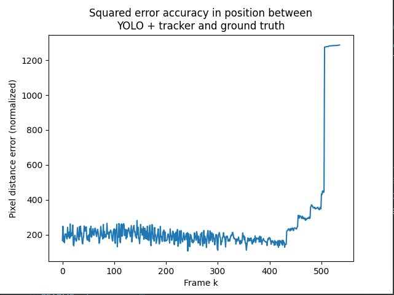

# Rapport technique

## Anaelle JAFFRÉ, Thomas Wanchaï MENIER, Pauline PROST–WATERSON, Antonin DE BOUTER

# Réponse au besoin

La demande initiale était la suivante : mettre en place un système de détection de drones, qui retourne les coordonnées du drone dans le repère de la caméra, à la lecture d’une vidéo.

La solution déployée permet effectivement la détection d’un drone dont les références sont connues, pour les trois types de caméras fournies. Elle retourne la position dans l’espace pour une caméra fixe, au sol, orientée horizontalement. Cependant, la détection n’est pas toujours effective, et peut bloquer sur certains environnements, notamment lorsque le contraste entre le drone et le fond est trop faible.

# Description de la solution

Afin de détecter un drone et ses coordonnées dans l’espace, la solution finale se présente de la façon suivante :

* Détection : YOLO  
* Tracker : basé sur un filtre de Kalman  
* Position : Calcul grâce au *pinhole principle*, changement de repère grâce à la focale et à la taille du drone sur l’image *vs* dans la vie réelle.

Voici un schéma simplifié qui illustre le fonctionnement général de l’algorithme : 

![][image1]

# Spécifications des choix techniques

## Détection

Dans le cahier des charges, il a été proposé de **comparer l’efficacité** d’un système de détection basé sur OpenCV et d’un autre basé sur YOLO. L’analyse a montré une meilleure robustesse de YOLO par rapport à la méthode avec OpenCV.

### Suppression de fond avec OpenCV

Ce traitement des images utilise la **suppression du fond** de l’image. Pour les données restantes, chaque groupement de pixels à 255 est considéré comme un objet, et les contours peuvent être détectés. 

Cependant, la détection n'est pas vraiment efficace, puisque la suppression du fond se fait en comparant deux trames successives et en ne conservant que ce qui a changé entre les deux trames. Les mouvements infimes, tels que celui de l’herbe ou des feuilles des arbres sont également détectés, et considérés comme des objets au même titre que le drone.

Une des méthodes pour résoudre cette détection trop grande est d'utiliser un modèle qui permet d'ignorer l’herbe et les feuilles ou l’eau, comme décrit dans l’article de Fateme Bahri et Nilanjan Ray : *Dynamic Background Subtraction by Generative Neural Networks*. Cependant, **aucun modèle open source** n’a été trouvé pour réaliser cette tâche.

### YOLO

Pour la détection initiale et avec un minimum de faux positifs et faux négatifs, on utilise un modèle de la famille des YOLO, partant d’un entraînement de **détection de drone généraliste** puis adapté à nos images. Ce modèle, qui est d’une grande facilité d’utilisation grâce à la bibliothèque Python de Ultralytics, permet d’obtenir la position et la taille d’un drone dans l’image.

Un des avantages de cette méthode est sa **facilité d’amélioration**, car la performance du modèle est dictée par ses **poids**. Ceux-ci peuvent être mis à jour facilement, si une version plus performante est entraînée. Ainsi, avec l’acquisition de nouvelles données ou l’utilisation d’un algorithme plus récent, le modèle peut être ré-entraîné et mis à jour grâce à la modularité de la bibliothèque d’Ultralytics.

Cependant malgré notre entraînement supplémentaire il reste encore des cas spécifiques où la détection du drone est quasi impossible. En effet, dans les scénarios à faible luminosité, le drone foncé avec la forêt derrière est presque imperceptible, comme à un opérateur humain. Par contre dans ces scénarios mais avec les lumières du drone allumées le modèle finetuné montre une amélioration drastique des performances.

## Tracker

Avec le modèle YOLO qui permet de détecter dans une trame vidéo la position de plusieurs drones, on ajoute la fonctionnalité des *trackers* qui permettent de continuer à suivre un drone si ce dernier n’est pas détecté dans la trame suivante. Trois trackers différents ont été testés pour assister YOLO :

* **Bytetrack |** Tracker initial proposé dans le cahier des charges. Associe les détections entre trames en combinant score, IoU (Intersection over Union) et mouvement pour maintenir des identités stables tout en récupérant les objets faibles ou temporairement perdus.  
* **Tracker simple |** Filtre de Kalman.  
* **Tracker amélioré |** Proposition issue du cahier des charges. IMM issu d’une approche orientée sur Kalman en CV, CA ainsi qu’une implémentation d’IoU pour la détection de correspondance, tri et élagage.

Le tracker implémenté dans la solution est le Tracker simple, qui utilise le principe des filtres de Kalman. Son fonctionnement est décrit en **Annexes**.

### Métrique d’évaluation

L’objectif du tracker est de permettre au modèle de garder le **suivi de l’objet**. Cependant, un temps de détection long ne signifie pas une bonne détection : le tracker peut suivre une trajectoire d’un objet inexistant. La métrique proposée dans ce cas est donc de comparer les sorties des trackers avec la position réelle du drone sur l’image.

Une vérité terrain a été générée grâce à une modification du projet suivant (ajouté en submodule git) : [https://github.com/Wanchai290/anytrack](https://github.com/Wanchai290/anytrack). Plutôt que de labelliser à la main pendant des heures, on a préféré utiliser un tracker KCF venant d’OpenCV pour nous aider à labelliser plus vite. Dès que le tracker perd la cible, l’utilisateur doit cliquer à nouveau pour réinitialiser le tracker. Le tracker KCF perdait souvent la cible dans nos tests, mais il suffisait à gagner en temps pour labelliser des données de test.

Les données sont exportées en JSON sous un array avec la position 2D du drone pour chaque trame (on a créé des données de test dans le cas où le drone ne disparaît pas de l’image).

### Résultats et limites

Sur une vidéo où un drone se déplace linéairement, on obtient les résultats suivants (avec une erreur en pixels, norme L2)

## Position du drone en environnement réel

### Procédé

Afin d’obtenir la position du drone dans l’espace, on récupère sa hauteur et sa position sur la trame lue. Ensuite, on effectue le rapport de la hauteur réelle du drone, dont le modèle est connu, sur sa hauteur en pixels, le tout modulé par le FOV vertical lié à la caméra choisie. On obtient la distance du drone à la caméra et on peut en déduire ses coordonnées dans l’espace. Les détails des calculs sont disponibles en **Annexes**.

### Vérification

Afin de vérifier leur validité, les résultats peuvent être comparés avec les données contenues dans les fichiers .srt, qui donnent l’altitude Y et la profondeur Z (sous le terme de “distance”).

### Limites

Bien qu’ayant une certaine marge d’erreur pouvant parfois varier sur quelques mètres, les résultats restent cohérents dans l’ensemble. Les imprécisions peuvent être obtenues à cause du point de vue : lorsque le drone est proche et que les hélices sont tournées vers le haut, la *bounding box* a une hauteur totale plus importante, ce qui diminue la distance calculée par rapport à la caméra. Cela peut se corriger en effectuant une moyenne glissante de la hauteur sur un ensemble de quelques trames. A contrario, lorsque le drone est loin, la mesure de sa hauteur sur l’image peut être imprécise. Dans ce cas, les limites sont matérielles.

### Ouverture

Il existe une librairie Python, [Kornia](https://kornia.readthedocs.io/en/latest/geometry.camera.pinhole.html), qui peut aussi être utilisée pour calculer la position dans l’espace. Il pourrait être intéressant de l’implémenter dans une seconde version.

# Annexes

## Tracker simple

Le tracker implémenté dans la solution suit le principe d’un filtre de Kalman.

### Initialisation

Le tracker prend une *bounding box* initiale et en extrait le centre (cx,cy). Il crée un état de Kalman avec ces positions, et y initialise une vitesse nulle. Le bruit de mouvement Q a été défini à 0.01 et le bruit de mesure R à 1, par convention, mais ils peuvent être adaptés pour améliorer le modèle. On initialise aussi P, la covariance de l’état, H, la matrice d’extraction des centres et F, le modèle de vitesse constante.

### Prédiction

L’état se met à jour, on ajoute les vitesses aux positions pour prédire le pas suivant. L’incertitude augmente ensuite, selon le bruit de mouvement Q. Le centre prédit est renvoyé.

### Mise à jour

Le centre observé de l’objet est calculé en fonction de la *bounding box* donnée par l’algorithme qui utilise le tracker (dans notre cas YOLO), et le gain de Kalman K est calculé. Ce gain est influencé par la covariance de l’état, P, ainsi que par H et par R, le bruit de mesure.

Ensuite, l’état est mis à jour en fonction du gain, et la *bounding box* est mise à jour pour correspondre au centre prédit.

## 

## Calcul de la position 3D du drone

Pour calculer la position du drone dans l’espace 3D autour de la caméra, on utilise le principe de Pinhole. Ces calculs sont inspirés des [lectures du Stanford Computer Graphics Laboratory (2011)](https://graphics.stanford.edu/courses/cs148-11-fall/lectures/camera.pdf). Le principe est décrit sur les paragraphes suivants.

![][image2]

On possède le FOV (Field Of View) pour chaque caméra utilisée, ainsi que la hauteur de l’image réelle en pixels. Grâce à ces informations, on peut obtenir la valeur de la focale f selon la caméra utilisée. Dans les spécifications des caméras données, il y a trois paramètres pour le FOV : D, H et V.

![][image3]![][image4]

Ils correspondent à l’ouverture en fonction du côté de l’image choisi. Dans le contexte actuel, il est aisé de récupérer la taille de l’image en pixel. On choisit d’utiliser le FOV vertical (V) pour obtenir la focale, ce qui nous permet d'utiliser directement la hauteur de l’image h\_px en pixels pour le calcul de la profondeur Z :

![][image5]![][image6]

On connaît la hauteur du drone dans la réalité puisqu’on souhaite détecter un type de drone précis, le Mavic-Pro 4\. Selon les [caractéristiques techniques du site officiel](https://www.dji.com/fr/mavic-4-pro/specs), il possède une hauteur totale de H\_drone \= 135,2 mm lorsqu’il est déplié. Quant-à la hauteur de l’image en pixels, on peut la récupérer au chargement de la première trame lors de l’exécution du scripte. Cela permet ensuite de calculer la longitude et la latitude de l’objet dans l’espace centré sur la caméra, selon le schéma suivant : 

![][image7]

On a donc : 

![][image8]

On évalue la position du drone sur l’image en X et Y par rapport au centre (cx\_0, cy\_0) de chaque trame, mais cette décision peut être modifiée au besoin. Par exemple, si la caméra est posée au sol, on peut évaluer Y par rapport au niveau d’estimation du sol sur chaque trame. 

[image1]: images/image_rapport1.png
[image2]: images/image_rapport2.png
[image3]: images/image_rapport3.png
[image4]: images/image_rapport4.png
[image5]: images/image_rapport5.png
[image6]: images/image_rapport6.png
[image7]: images/image_rapport7.png
[image8]: images/image_rapport8.png
